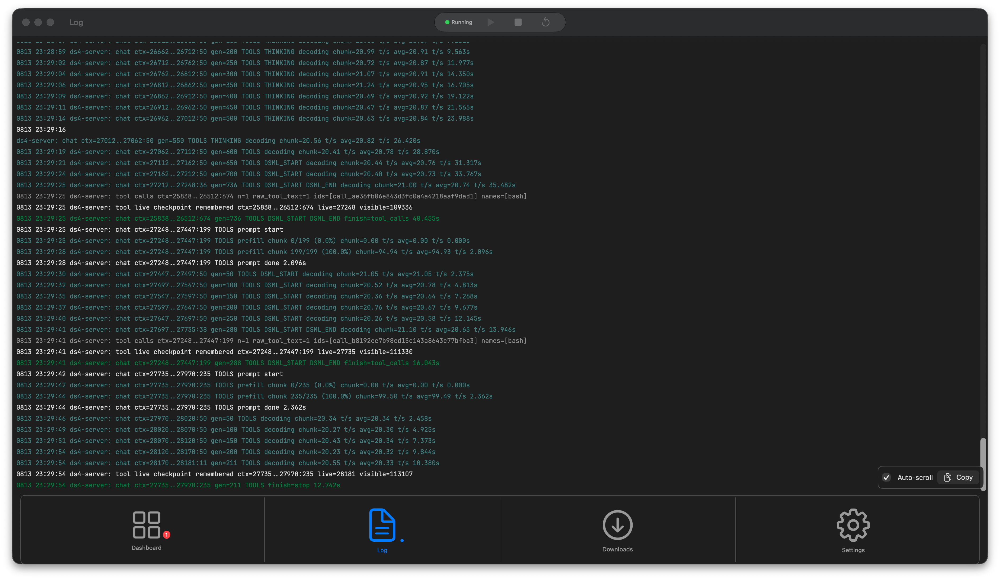
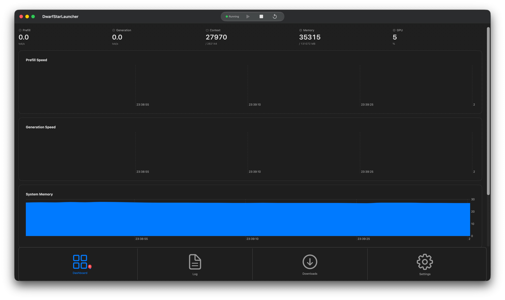
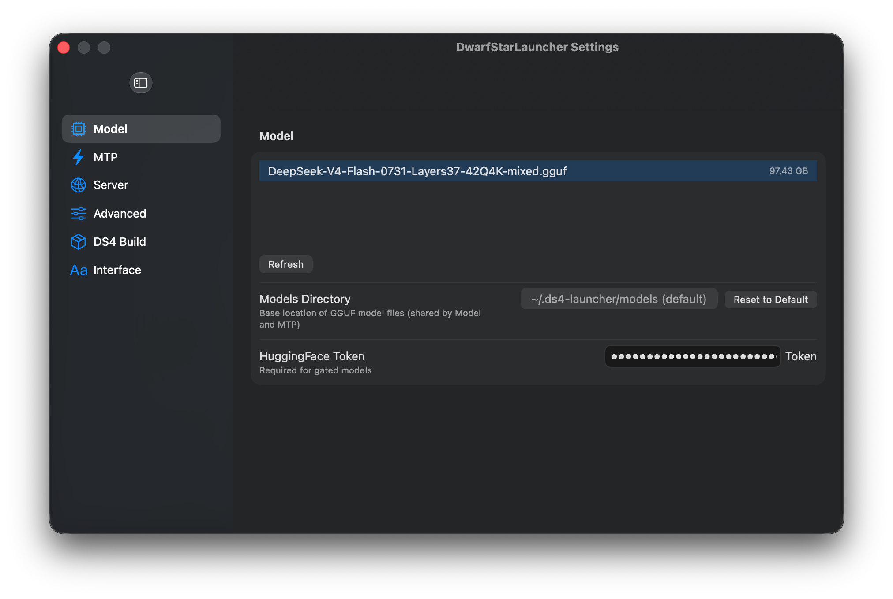

# DwarfStarLauncher

A native macOS app that launches, configures, and monitors a local LLM inference server ([ds4-server](https://github.com/anthropics/ds4)). Run any GGUF model on your Mac with a polished GUI — no terminal required.

I took interest in the ds4 project and started to use it on my personal hardware. Then I thought to develop a little GUI app for it using ds4 itself for inference, no usage of cloud APIs for inference.

## What it does

- **Model management** — Discover `.gguf` files in `~/.ds4-launcher/models/`, download models directly from HuggingFace Hub, and configure multi-token prediction (MTP) models.
- **Server lifecycle** — Start, stop, and restart the ds4-server process with graceful shutdown.
- **Live telemetry** — Real-time charts for prefill/generation throughput (tokens/sec), context utilization, memory usage, and GPU load.
- **Color-coded logs** — Auto-scrolling log viewer with ANSI support.
- **Menu bar access** — Control the server from the macOS menu bar with a tray icon.
- **Persistent config** — All settings saved to JSON and restored on launch.

Zero external dependencies. Built with Swift 5.9+ and SwiftUI for macOS 14.0+.

## Screenshots

| Metrics & Logs | Metrics Graph |
|:---:|:---:|
|  |  |  | 

## Quick Start

1. Clone the repo and open the SPM package.
2. Build with `swift build` or from Xcode.
3. Place the `ds4-server` binary somewhere on your `PATH`, or set its path in the app's configuration.
4. Launch the app — it will scan for models, let you download new ones, and start the server with one click.

## Documentation

This project uses **OpenWiki** for auto-generated code documentation. The docs are derived from source code and kept up to date by scheduled GitHub Actions — you shouldn't need to hand-edit them.

| Resource | Description |
|---|---|
| [openwiki/quickstart.md](openwiki/quickstart.md) | High-level overview and quick-start guide |
| [Architecture Overview](openwiki/architecture/overview.md) | Service layer design, data flow, and rationale |
| [Domain Concepts](openwiki/domain/llm-launcher.md) | ds4-server contract, GGUF format, download targets |
| [View Hierarchy](openwiki/views/overview.md) | Complete SwiftUI component breakdown |
| [Setup & Operations](openwiki/operations/setup.md) | Build instructions, configuration, troubleshooting |
| [External Integrations](openwiki/integrations/external.md) | ds4-server binary, HuggingFace Hub, file layout |

## Project Structure

```
Sources/App/
├── DwarfStarLauncherApp.swift   @main entry point
├── Models/                      GGUFModel, ServerConfig, ServerStatus, LogLine, DownloadState
├── Services/                    ServerManager, StatusMonitor, ModelManager, ModelDownloader
├── Views/                       ContentView, ConfigurationPanel, LogView, MetricsView, TrayMenu, etc.
└── Utilities/                   PathResolver
Resources/                       App icon, Info.plist
```

## License

[MIT License](LICENSE)
